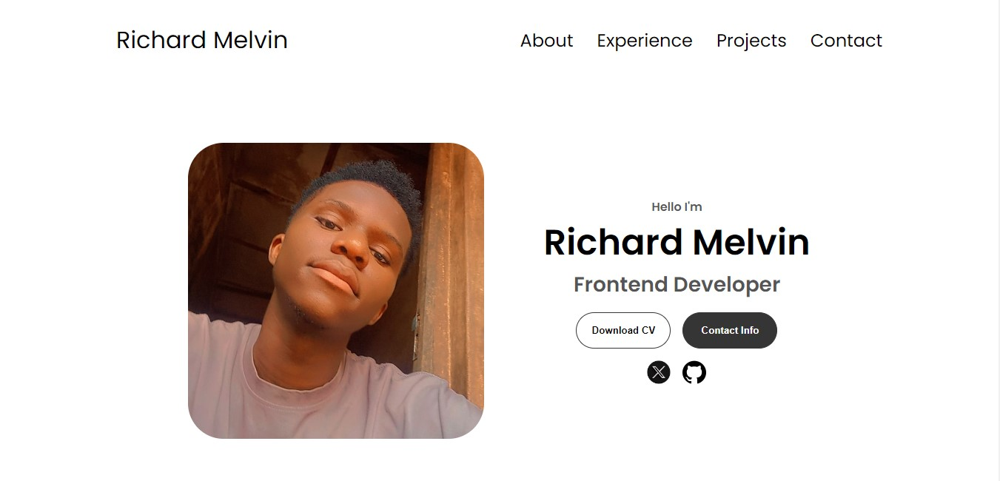

# RESPONSIVE PORTFOLIO WEBSITE TEMPLATE

## Introduction

This repository contains the source code for my personal portfolio website, where I showcase my professional accomplishments, skills, and projects. The website is designed to provide visitors with insights into my background, expertise, and interests.

### [Deployed Site](https://responsive-portfolio-template.vercel.app/)
### [Final Project Blog Article](https://medium.com/@richardmelvin019/responsive-portfolio-website-9e337e59dafa)

## Installation

#### To run this project locally, follow these steps:
* Clone the repository to your local machine:
    git clone https://github.com/RichardMelvin019/Responsive-portfolio_template.git
* Navigate to the project directory:
    cd Responsive-portfolio_template

## Usage
Once the project is cloned and you are in the project directory, open the index.html file in your preferred web browser to view the website.

## Contributing
Contributions are welcome! If you would like to contribute to this project, please follow these steps:
* Fork the repository.
* Create a new branch for your feature or bug fix.
* Make your changes and ensure they are properly tested.
* Commit your changes and push to your forked repository.
* Submit a pull request to the main repository's develop branch.

## Related Projects

### Frontend Frameworks and Libraries

1. [Bootstrap](https://getbootstrap.com/): A popular frontend framework for building responsive and mobile-first websites. Bootstrap offers a wide range of pre-designed components and utilities.
   
2. [Tailwind CSS](https://tailwindcss.com/): A utility-first CSS framework that allows you to quickly build custom designs without writing any CSS. Tailwind CSS offers a unique approach to styling with utility classes.

### Portfolio Templates

1. [FreeHTML5.co](https://freehtml5.co/): Provides a collection of free HTML5 templates suitable for creating personal portfolios, blogs, and business websites. These templates are responsive and customizable.

2. [Colorlib](https://colorlib.com/wp/template/): Offers a variety of free and premium HTML templates for different purposes, including portfolio websites. These templates come with modern designs and responsive layouts.

### Portfolio Showcase Examples

1. [CodePen](https://codepen.io/): A community-driven platform for showcasing HTML, CSS, and JavaScript projects. You can find numerous examples of responsive portfolio designs created by developers worldwide.

2. [Dribbble](https://dribbble.com/): A platform for designers to showcase their work, including portfolio designs. You can explore a wide range of creative and visually appealing portfolio showcases for inspiration.

### Portfolio Optimization Tools

1. [Google PageSpeed Insights](https://developers.google.com/speed/pagespeed/insights/): A tool provided by Google to analyze the performance of web pages and provide suggestions for optimization. Useful for ensuring your portfolio website loads quickly and efficiently.

2. [Lighthouse](https://developers.google.com/web/tools/lighthouse): Another tool from Google that helps audit the quality of web pages, including performance, accessibility, and SEO. Lighthouse can provide actionable insights for improving your portfolio website.

### Inspirational Portfolio Websites

1. [Awwwards](https://www.awwwards.com/websites/portfolio/): Awwwards showcases award-winning websites, including portfolio designs. You can explore innovative and visually stunning portfolio websites created by top designers and developers.

2. [Behance](https://www.behance.net/galleries/web-design): Behance is a platform for creative professionals to showcase their work, including web design portfolios. You can find a diverse range of portfolio styles and layouts for inspiration.

## Licensing
This project is licensed under the MIT License.

## Project Inspiration:

The inspiration for creating my portfolio website stemmed from my desire to establish a professional online presence and showcase my skills and projects to potential employers and collaborators. As a budding developer, I recognized the importance of having a central platform to highlight my accomplishments and share my journey in the tech industry.

## Technical Challenges:

While building the portfolio website, I encountered several technical challenges, one of which was ensuring responsiveness across different devices and screen sizes using only HTML, CSS, and JavaScript. Achieving a visually appealing layout while maintaining code simplicity and performance was particularly daunting.

## Next Iteration:

For future iterations of the portfolio website, I envision incorporating additional features such as a blog section to share insights and experiences, integration with social media platforms for enhanced networking, and further optimization for accessibility and SEO..

## Timeline:

The project commenced in 23rd February 2024 and underwent iterative development over some weeks. From initial wireframing and design to deployment and refinement, the journey was filled with learning opportunities and moments of inspiration.

## Human Element:

Behind the code and pixels lies the story of a passionate individual striving to carve out a space in the vast landscape of technology. Through this project, I aimed to not only showcase my technical skills but also share a glimpse of the person behind the keyboard – someone driven by curiosity, creativity, and a relentless pursuit of excellence.

## AUTHOR
### Melvin Nzekwe <richardmelvin019@gmail.com> [Github Profile](https://github.com/RichardMelvin019)

